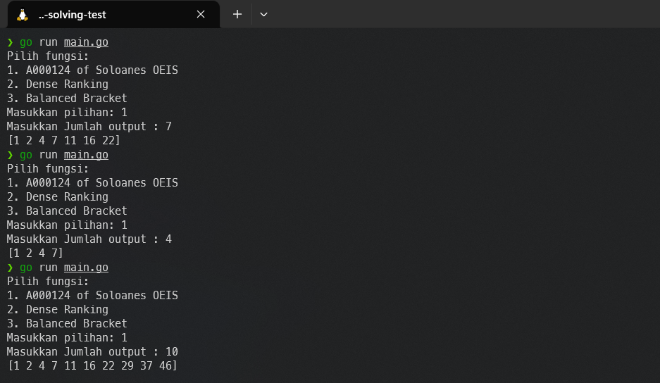
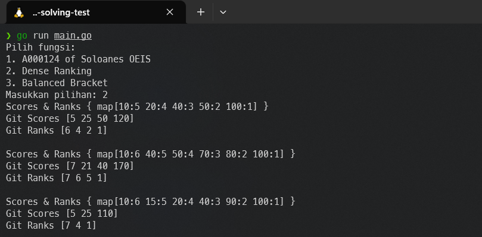
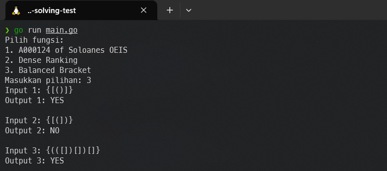

# internship_problem-solving-test

## Soal 1
Buatlah sebuah program dengan output sebagai berikut. Input bisa dinamis yang menghasilkan output yang berbeda-beda sesuai input yang dimasukan. Gunakan rumus A000124 of Sloane’s OEIS.
> Jawab : 
    

## Soal 2
Buat fungsi yang digunakan untuk menyelesaikan permasalahan Dense Ranking!
> Jawab : 
    

## Soal 3
1. Buat fungsi untuk menemukan Balanced Bracket dengan kompleksitas paling rendah!
    > Jawab : 
        
2. Berapa ukuran kompleksitas kodinganmu? (cantumkan di README Repo)
    > Jawab :  O(n), di mana n adalah panjang string s.
3. Jelaskan detail kompleksitas codingan Balanced Bracket Anda. (cantumkan di README Repo)
    > Jawab : 
    1. Pendeklarasian stack := []int32{} dan brackets := map[int32]int32{...} memiliki time complexity O(1) karena hanya dilakukan sekali pada awal fungsi.
    2. Fungsi isOpeningBracket(c int32) bool tidak memiliki perulangan atau iterasi yang berarti, sehingga memiliki time complexity O(1).
    3. Perulangan for _, char := range s berjalan sebanyak panjang string s, misalkan n. Setiap iterasi dalam perulangan hanya melibatkan operasi O(1), yaitu pemanggilan fungsi isOpeningBracket, pengujian kondisi, dan beberapa operasi slice dan append, yang juga memiliki time complexity O(1).
    4. Total dari perulangan ini adalah O(n), di mana n adalah panjang string s.
